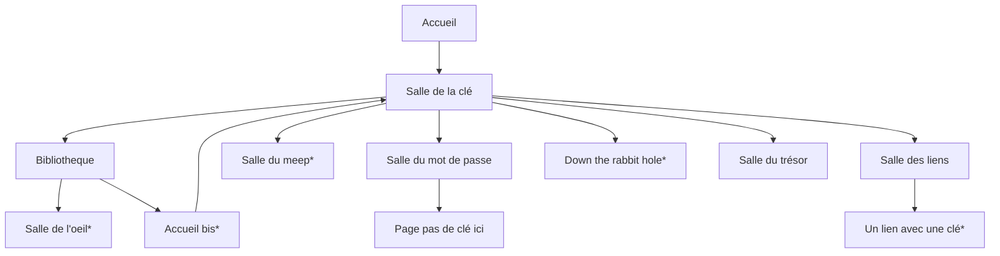

# SuperNiceCTF
CTF réalisé pendant le module de Hacking éthique | formation maalsi - cesi | Inspiré du site SuperBad

Le joueur a pour objectif de trouver une clé pour accéder à la salle du tésor.
Seul problème: cette clé a été découpée en cinq morceaux et il faut traverser les différentes pages du site pour retrouver les morceaux cachés.

Les clés peuvent être cachées n'importe où: dans une image, dans le code d'un script ou tout simplement là dans la page sans que vous ne la voyez.
Alors bon courage et bonne exploration !
M

----------------------------------------
Visite guidée du site SuperNiceCTF.

La page d'accueil est ce qu'elle est: il faut cliquer sur le camion pour aller dans la salle de la clé.
Cette salle est le pillier du site puisqu'elle permet de rejoindre toutes les autres pages. C'est ici qu'il faudra insérer la clé à la fin du jeu.
Des liens sont placés aléatoirement sur la page dès qu'elle est raffraichie.

La bibliotheque est une page html sans css avec beaucoup de texte dans laquelle il faut trouver un lien caché dans le texte.
Une fois le lien trouvé, on est redirigé vers la salle de l'oeil où, il faudra bien observer pour trouver la clé.

La salle bibliothèque a une particularité, elle est la seulle à rediriger l'utilisateur vers l'accueil bis: une copie conforme de la page d'accueil avec une clé cachée dans l'image.

La salle du meep est une salle où l'utilisateur doit cliquer 15 fois sur le meep pour faire apparaître la clé.

La salle des liens est très sympa, c'est comme la bibliotheque mais chaque mot est un lien. Donc il va falloir bien regarder le code pour trouver le lien fonctionnel et arriver à la page "Un lien avec une clé".

La salle du mot de passe ne sert à rien à part à faire perdre du temps au joueur.

La salle du trou du lapin est une page avec un scroll très long et des images partout, il faudra bien fouiller dans la page pour trouver la clé cachée.

Une fois les 5 clés trouvées, rendez-vous à la salle de la clé. Seul soucis, notre clé ne marchera pas comme ça.
Il faudra que l'utilisateur la transforme en base 64 pour être fonctionnelle.

Enfin la salle du trésor c'est une salle arc-en-ciel avec "never gonna give you up qui joue".

Voilà
